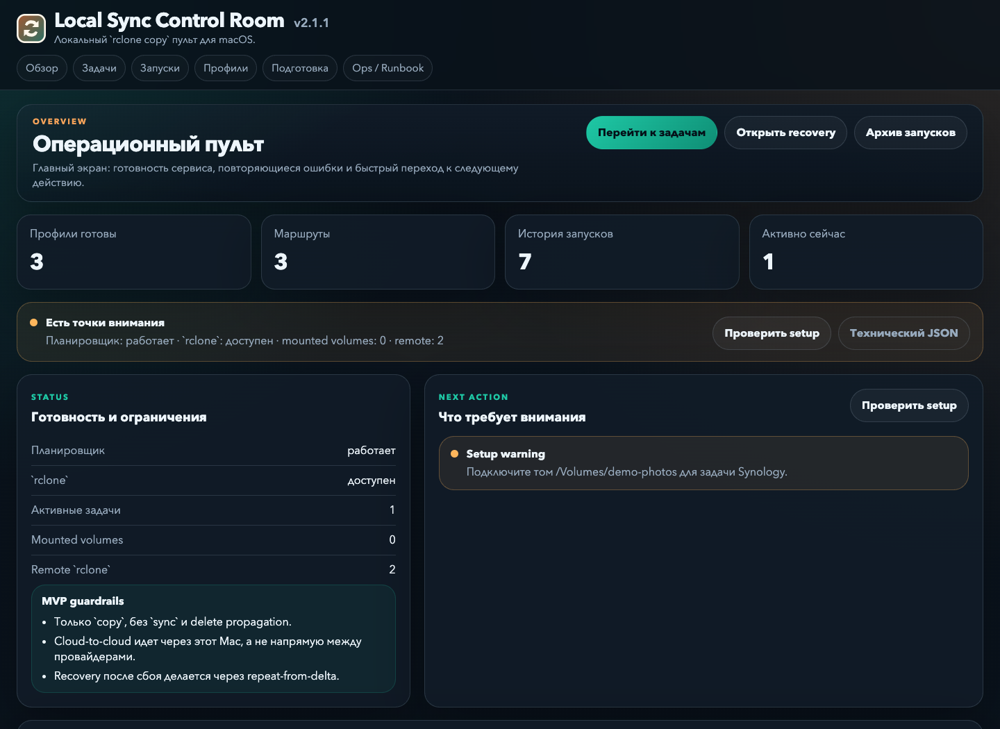
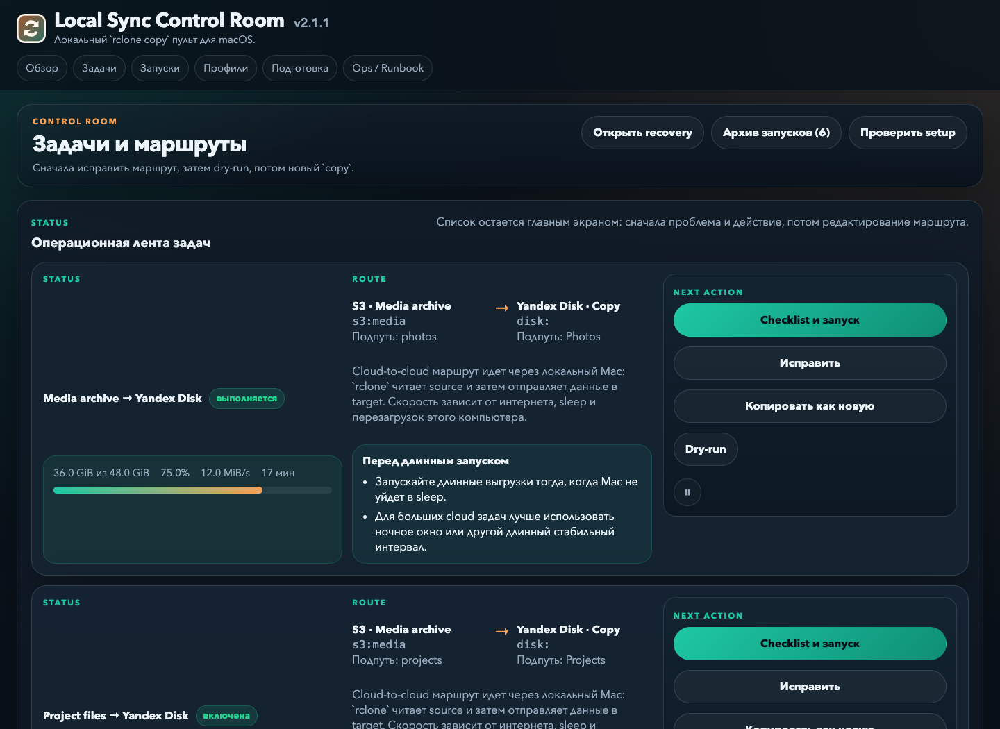
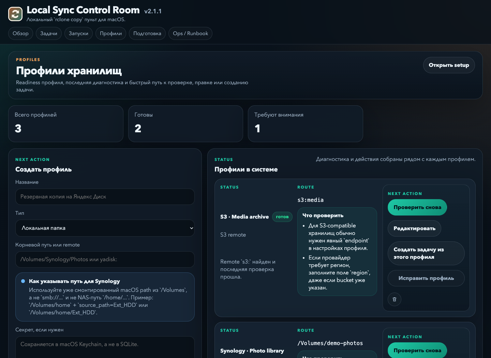
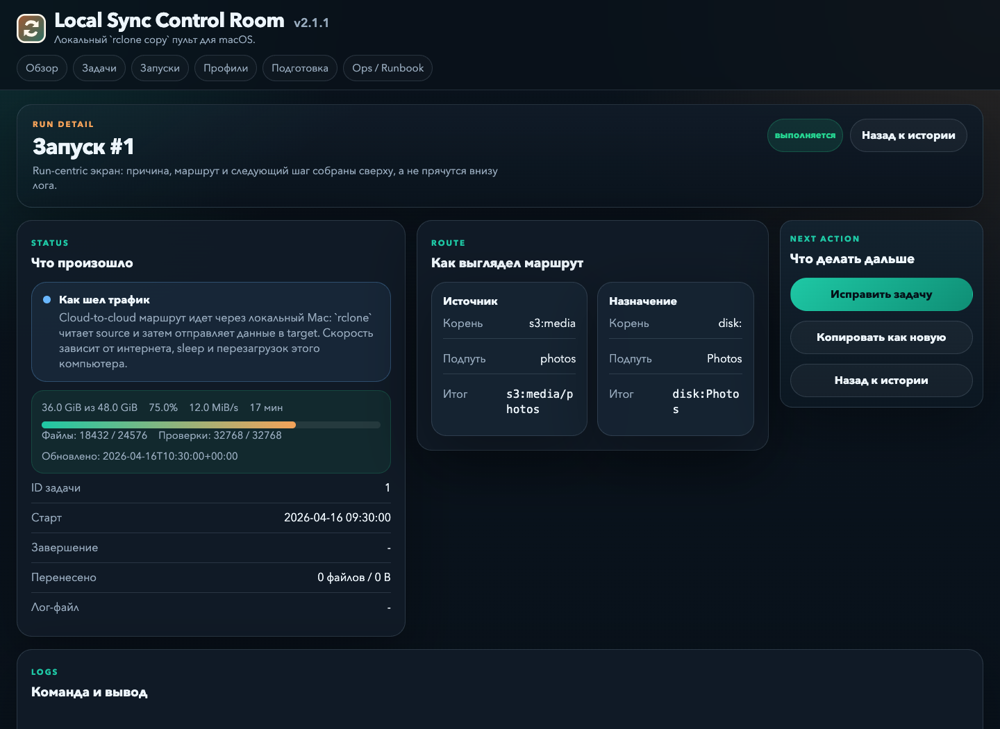
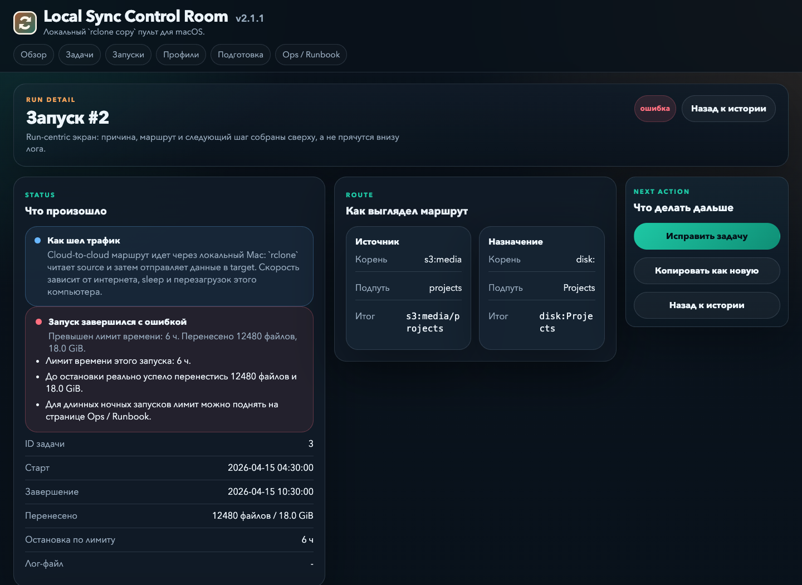
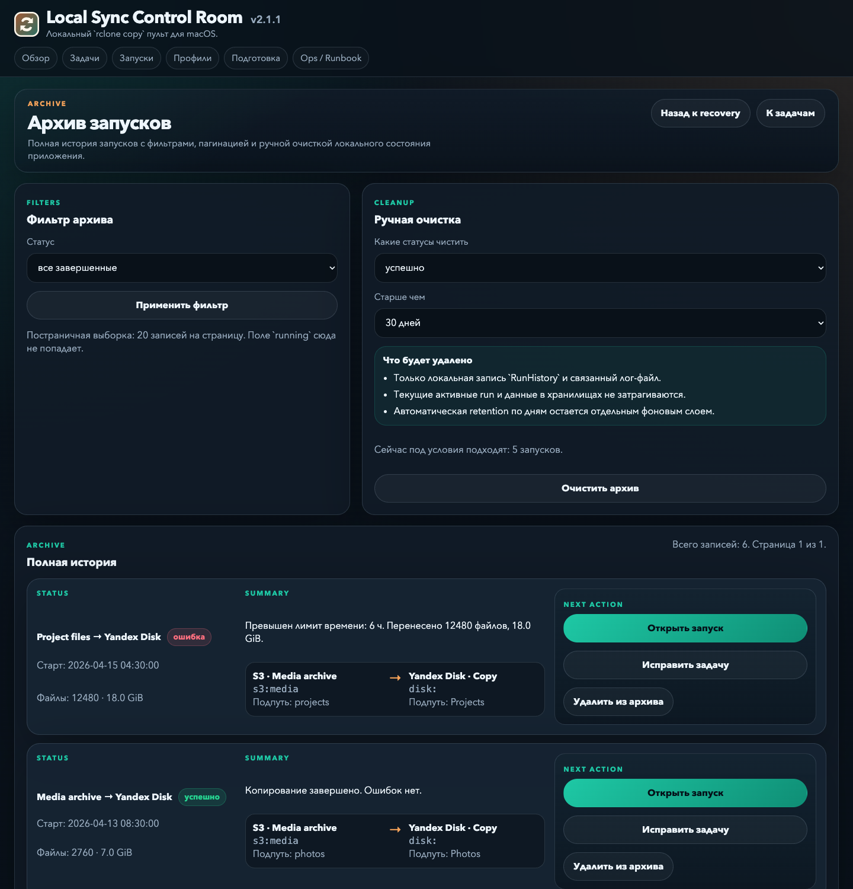

# Screenshots · Скриншоты

[English overview](../README.md) · [Обзор на русском](../README.ru.md)

Real **v2.1.1** templates, rendered with synthetic data. Names, paths, progress, connection checks, and run history are examples, not production measurements. The application UI is currently in Russian; each screenshot has English and Russian captions below.

Настоящие шаблоны **v2.1.1** с вымышленными данными. Имена, пути, прогресс, проверки подключений и история приведены для примера, а не как реальные измерения. Интерфейс приложения сейчас на русском; подписи к каждому скриншоту даны на двух языках.

## 01 · Overview / Обзор

**EN:** Service readiness, route counts, and the next action in one control room. This example flags a disconnected Synology volume.

**RU:** Готовность сервиса, количество маршрутов и следующий шаг на одном экране. В примере показан отключённый том Synology.



## 02 · Jobs / Задачи

**EN:** Reusable routes, schedules, actions, and live copy progress. Job-level settings control rclone concurrency and listing behavior.

**RU:** Маршруты, расписания, действия и живой прогресс копирования. В задаче можно настроить параллелизм rclone и способ получения списка файлов.



## 03 · Storage profiles / Профили хранилищ

**EN:** Named storage connections with status checks and contextual diagnostics. Cloud profiles use existing rclone remotes; Synology profiles use mounted local paths.

**RU:** Именованные подключения к хранилищам со статусами и контекстной диагностикой. Облачные профили используют готовые rclone remotes, Synology — смонтированные локальные пути.



## 04 · Live transfer / Текущий перенос

**EN:** Inspect transferred bytes and files, progress, speed, ETA, and the exact route while a copy is running. All metrics shown here are simulated.

**RU:** Во время копирования видны байты и файлы, прогресс, скорость, ETA и точный маршрут. Все показатели в этом примере смоделированы.



## 05 · Timeout recovery / Восстановление после таймаута

**EN:** A stopped run shows its time limit and the amount already transferred. Check the cause, adjust the limit in Ops if needed, and repeat the same route from the remaining delta.

**RU:** Остановленный запуск показывает лимит времени и уже перенесённый объём. Проверьте причину, при необходимости измените лимит в Ops и повторите тот же маршрут с оставшейся дельты.



## 06 · Run archive / Архив запусков

**EN:** Full history has its own page, with filters, pagination, and local-history cleanup. Current operational work remains on the Runs screen.

**RU:** Полная история вынесена на отдельную страницу с фильтрами, пагинацией и очисткой локальных записей. Текущая работа остаётся на экране запусков.



## Reproduce the screenshots / Как повторить съёмку

From the repository root, after installing the project dependencies:

Из корня репозитория после установки зависимостей проекта:

```bash
.venv/bin/python -m scripts.render_public_demo
.venv/bin/python -m http.server 8765 --bind 127.0.0.1 --directory output/playwright/demo
```

Open `http://127.0.0.1:8765/` in a browser and capture the routes `/`, `/jobs/`, `/profiles/`, `/runs/1/`, `/runs/2/`, and `/runs/archive/` at a 1440 × 1050 viewport (1440 × 1500 for the archive). Store captures under `output/playwright/`, review them, and copy the six selected PNGs into `docs/images/`. Stop the temporary server with Ctrl+C when finished.

Откройте `http://127.0.0.1:8765/` в браузере и снимите маршруты `/`, `/jobs/`, `/profiles/`, `/runs/1/`, `/runs/2/` и `/runs/archive/` при размере области просмотра 1440 × 1050 (1440 × 1500 для архива). Сохраните снимки в `output/playwright/`, проверьте их и перенесите шесть выбранных PNG в `docs/images/`. После завершения остановите временный сервер через Ctrl+C.

The renderer uses an in-memory database, a temporary data directory, and mocked diagnostics/runtime snapshots. It does not start the application lifespan, scheduler, or rclone. It only serves static screenshot fixtures; forms do not perform app actions. No secrets or real application data are needed.

Генератор использует БД в памяти, временный каталог данных и подставные результаты диагностики/runtime snapshots. Он не запускает lifespan приложения, планировщик или rclone. Это статические страницы для съёмки; формы не выполняют действия приложения. Секреты и рабочие данные не требуются.
